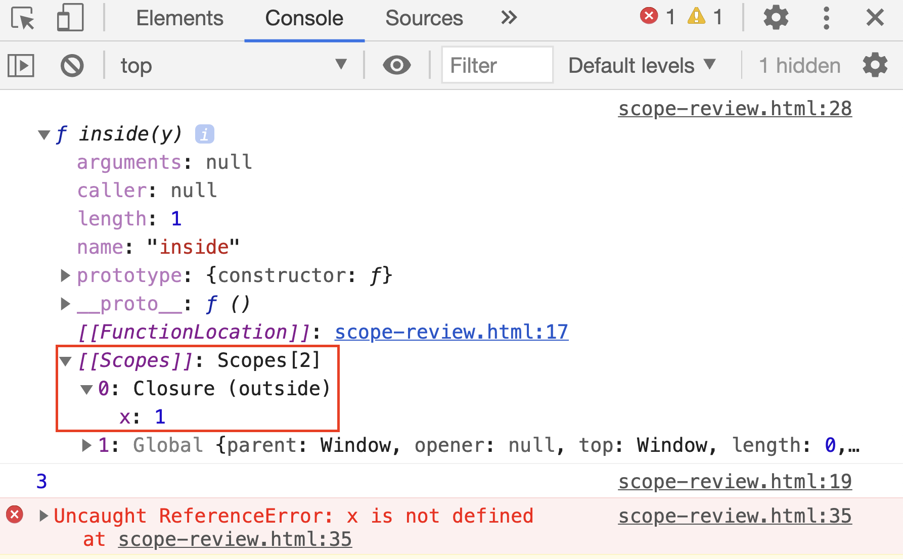
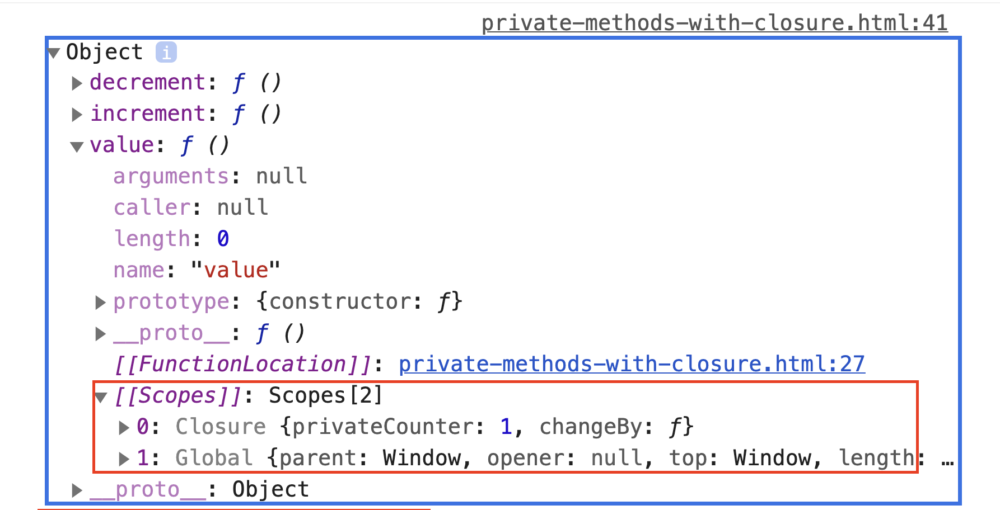

# Java Script Closures Lesson Plan

## Overview
In this plan we're going to dive deeper into scopes by talking about closures.

## Assumptions
I'm assuming students would already have had some exposure to lexical scopes and since closures rely heavily on scoping I decided to include a review of scoping.

I'm also going to assume that students have seen event handling and callbacks but this lesson plan can be modified as a segue to talk about event handling and callbacks.

## Class Instructions

### 1. Instructor Welcome: Intro to Closures

* Explain to class that we are going to cover the topic of **closures** and the concept of hoisting when it comes to executing a function.

* A **closure** is the combination of a function bundled together (or rather enclosed) with references to its surrounding state (the lexical environment). In other words, a closure gives you access to an outer function’s scope from an inner function **even after the outer function has completed since the inner function will have the state that is was created in still in memory**. In JavaScript, closures are created every time a function is created at function creation time.

* Closures are frequently used in JavaScript for object data privacy, in event handlers and callback functions, and in partial applications, currying, and other functional programming patterns.

### 2. Instructor Do: Review Lexical Scope
* Open `scope-review.html` and ask students to answer the questions posed in the comments. The key concept to address is *closures*. Explain the following points:
* 
   * When the return value of `outside()` is assigned to `insideOut`, a **closure** is created.
   
   * And since a closure is an object that contains both a returned function and the environment in which that function was created, when we call `insideOut()`, it returns the values stored in `x` and `y` even though those were declared outside `inside()`.
   
   * Show students that they can see if a function has closure by adding `console.dir(insideOut)` after `insideOut()` is assigned to `outside()`. In the Chrome Console, show the students that if they expand `f inside(y)` they will see `[[Scopes]]: Scopes [2]` which they can expand to see `Closure (outside)` that shows `inside` has access to `x` with a value of `1` from the `outside` function. 

  

* If students have further questions about closures, refer them to the [MDN docs on closures](https://developer.mozilla.org/en-US/docs/Web/JavaScript/Closures).

### 3. Students Do: Closure Review

* Have students open `Unsolved/working-with-closure.html` in `02-STU-ClosureReview`. Ask them to determine where the scope is for each variable and what the console log will be without running the script in a browser.

### 4. Instructor Do: Review Closure 

* The students may have been able to get the scoping and the first 2 logs (go over if some students have not been able to get the correct answers) but may have been tripped up when `outer2()` was called a second time.

* Explain that the reason why console.log returns a value of `12, 21` after `outer2()` was called a second time is because everytime a function is created with a variable inside as `inner2` is created when `outer2` is called, the variable is set to that function's original value. Since `x` is a global variable it will get get updated and saved to memory when it passes through `inner2` which is why it shows as `12` the 2nd time `outer2` is run. But y is not saved since when `outer2` has finished executing, everything inside of `inner2` would be removed from memory. 

### 5. Instructor Do: Examples of Closures

* Explain the object-oriented languages such as Java allow you to declare methods as *private*, meaning that they can be called only by other methods in the same class. JavaScript does not provide a native way of doing this, but it is possible to emulate private methods using closures. Private methods aren't just useful for restricting access to code. They also provide a powerful way of managing your global namespace.

* Open `private-methods-with-closure.html` in `03-INS-ClosureExamples`

* Here a single lexical environment is shared by the three functions: `counter.increment`, `counter.decrement`, and `counter.value`. The shared lexical environment is created in the body of an anonymous function & contains two private items: a variable called `privateCounter`, and a function called `changeBy`. You can't access either of these private members from outside the anonymous function. Instead, you can access them using the three public functions that are returned from the anonymous wrapper.

* Those three public functions are closures that share the same lexical environment. Thanks to JavaScript's lexical scoping, they each have access to the privateCounter variable and the changeBy function.

* Point out that the format of the function looks a bit different as the entire function is wrapped in parentheses and followed by an empty set of parentheses. This design makes the JavaScript function run as soon as it is created. This type of function is known as an IIFE (Immediately Invoked Function Expression) and it has 2 parts:
  *  The first is the anonymous function with lexical scope enclosed within the Grouping Operator (). This prevents access to variables within the IIFE.
  *  The second part creates the immediately invoked function expression () through which the JavaScript engine will directly interpret the function.

* Students can learn more about IIFE at https://developer.mozilla.org/en-US/docs/Glossary/IIFE


### 6. Students Do: Private Methods Created with Closure

* Have students open `Unsolved/private-methods-with-closure.html` in `04-STU-ClosureReview`. Using the code from the demo, ask the sudents to create 3 counters called `counter1`, `counter2`, & `counter3` using the `makeCounter()` function. Then run the `increment()` and `decrement()` functions a mixed series of times against each counter so that each counter has a different result when they console.log the `value()` function. Students should also use console.dir against each counter so they can see how the closure object appears as one of the scopes for each function.

### 7. Instructor Do: Review Private Methods Created with Closure

* Students should have been able to create the new counters as there was one already setup for them. Some may have not been able to find the closure object in the console. 



* Go over `Solved/private-methods-with-closure.html`.
* Check to see if the students notice how the two counters maintain their independence from one another. That is because each closure references a different version of the `privateCounter` variable through its own closure. Each time one of the counters is called, its lexical environment changes by changing the value of this variable. Changes to the variable value in one closure won't affect the value in the other closure.

* Inform the students that using closures in this way provides benefits that are normally associated with object-oriented programming. In particular, data hiding and encapsulation. 

* If a student asks if this is the same as using `class`, then tell them it is except using classes is better than using closures since closures will need to hold every function in memory while classes don't. Let the student know we will be going over `class` another time. 

### 8. Instructor Do: Common Usage of Closures

* Let the students know that closures are useful because they let you associate data (the lexical environment) with a function that operates on that data. This has obvious parallels to object-oriented programming, where objects allow you to associate data (the object's properties) with one or more methods.

* Inform the students that they have already seen closures in some of the work and exercises they did throughout the course. Closures are used in event handling and callback functions as when making an API call to get data.

* Open `index.html` in `05-INS-ClosureUsage` in a browser. Demonstrate hat the application works as intended by switching the typeface.

  * Select serif, then go back to sans-serif. 

  * Type some random text in the textarea.

* Open `script.js`. Point out how each of the `addEventListeners` methods have two arguments: the first is the name of the event the listener is supposed to be listening for and the second is an anonymous function that contains what the listener is supposed to do when even is triggered. That anonymous function is an example of a closure since this function can only be triggered by a certain event and no outside function can access the variables other than those created and called in it.

```javascript
typefaceEl.addEventListener("change", function(event) {
  event.preventDefault();
  typeface = typefaceEl.value;
  document.querySelector(".container").style.fontFamily = typeface;
});

textAreaEl.addEventListener("keydown", function(event) {
  var key = event.key.toLowerCase();
  var alphabetNumericCharacters = "abcdefghijklmnopqrstuvwxyz0123456789 ".split("");
  if (alphabetNumericCharacters.includes(key)) {
    elements.forEach(function(element) {
      element.textContent += event.key;
    });
  }
});

clearEl.addEventListener("click", function(event) {
  event.preventDefault();
  textAreaEl.value = "";
  elements.forEach(function(element) {
    element.textContent = "";
  });
});

```

### 9. Students Do: Using Closures on Web Application

#### Instructions

* Open `index.html` in `Unsolved/06-INS-ClosureUsage` in a browser and take a moment to study the application.

* Take a moment to study the code in `index.html` then add the following functionality to the application:

  1. The select element should trigger the `toggleDisplay` function in `script.js`.

  2. If `key` is selected, the event's code, key, and status (keydown or keyup) should be displayed in the `#key-events` div when the user presses a key anywhere on the document.

  3. If `click` is selected, the text content of the event's target, and the cursor's x and y coordinates should be displayed in the `#click-events` div when the user clicks the anywhere on document.

### 10. Instructor Review 

* As in the previous demo, go over the code and ask students of they have any questions. 

* Ask the class if they can think of some more examples of when closures would come in handy?

* After hearing some examples, bring up the issue with async callbacks in loops particulaly with setTimeout.

* Slack out the following code and tell the students that we want to count starting from 0 and have the console.log print each number after 1 second:
  ```js
    var i;
    var print = function() {
    console.log(i);
    }
    for (i = 0; i < 10; i++) {
        setTimeout(print, 1000);
    }
  ```

  What happens when this code is run? And how do we fix it?

  The answer is we need to add another closure and create a new variable to keep track of i since i has a value of 10 after for loop iterates & stops when i=10 after waiting 1 second:

  ```js
    var i;
    for (i = 0; i < 10; i++) {
        // Insert IIFE closure here
        (function() {
            var currentValue = i;
            setTimeout(function() {
            console.log(i);
            }, 1000);
        })();
    }
  ```
  With a closure added, i will carry it's value from the loop since the anonymous function will not allow i=10 to get in from the loop.
